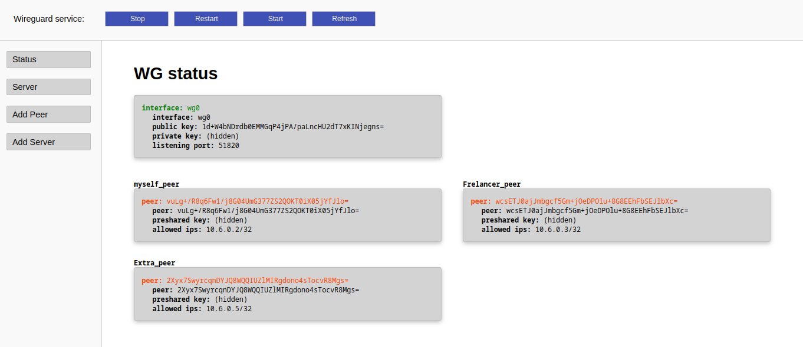
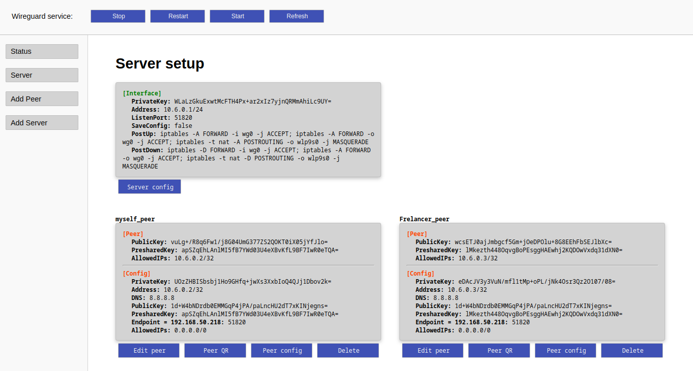

# wireguardmanager

Simple manager for wireguard.

Create server and peer configurations, and manage them.

Supports 1 wireguard server.

## Installation

```bash
curl https://nim-lang.org/choosenim/init.sh -sSf | sh
git clone https://github.com/ThomasTJdev/nim_wireguardmanager.git
cd nim_wireguardmanager
nimble build
sudo ./wireguardmanager
# http://127.0.0.1:8080
```

## Requirements

1) Linux machine
2) You have wireguard (wg) installed
3) You run it as root (or with sudo)

## Screenshots

**Status**



**Server**

